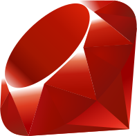

### Hi there 👋

Hehe :sweat_smile:, this file is still in progress.

My coding arsenal:

 - [Python](https://www.python.org/ "Python's website") <a href="https://www.python.org/" title="Python's website"></a> <!--Will change to assets/images/logos/python-logo.svg-->
 - [Atom](https://atom.io/)
 - [Kite](https://www.kite.com/)
 - [TabNine](https://www.tabnine.com/)
 
Languages I know:
 - [English](https://www.duolingo.com/course/en/vi/Learn-English "Learn English")
 - [Python](https://www.python.org/ "Python's website") <a href="https://www.python.org/" title="Python's website"></a> <!--Will change to assets/images/logos/python-logo.svg-->

Languages I'm learning (in priority order):
 - [Chinese](https://www.duolingo.com/course/zh/en/Learn-Chinese "Learn English")
 - C++
 - Swift
 - JavaScript
 - [Ruby](https://www.ruby-lang.org/ "Ruby's website") <a href="https://www.ruby-lang.org/" title="Ruby's website"></a> <!--Will change to assets/images/logos/ruby-logo.svg-->
 
 
## Why?

In progress...

<!--
**ThatXliner/ThatXliner** is a ✨ _special_ ✨ repository because its `README.md` (this file) appears on your GitHub profile.

Here are some ideas to get you started:

- 🔭 I’m currently working on ...
- 🌱 I’m currently learning ...
- 👯 I’m looking to collaborate on ...
- 🤔 I’m looking for help with ...
- 💬 Ask me about ...
- 📫 How to reach me: ...
- 😄 Pronouns: ...
- ⚡ Fun fact: ...
-->
